# SCARPA SEO & AI-Search Overhaul

**Case Study | SEO Strategy | AI-Ready Content Systems**

This repository documents a large-scale SEO transformation project executed at SCARPA North America, focused on future-proofing product content for **AI-driven search** while improving clarity, governance, and cross-team execution.

Rather than chasing keywords alone, this initiative treated SEO as a **content system**—one designed to support:
- Human shoppers
- Search engines
- Large language models (LLMs)
- Internal teams (Marketing, Sales, Product, Leadership)

---

## 🎯 Outcomes

- Improved AI readability across **134 product pages**
- Reduced reliance on paid media through stronger native search performance
- Established repeatable content standards for current and future products
- Aligned SEO execution across Marketing, Sales, and Product stakeholders
- Deployed a **custom GPT model** trained on brand-approved language

---

## 📂 What This Repo Covers

| Section | Purpose |
|------|------|
| **Context** | Business case, AI-search landscape |
| **Strategy** | SEO principles & content standards |
| **Workflow** | Governance, review cycles, PM approach |
| **Tooling** | Custom GPT, Monday.com workflows |
| **Artifacts** | Templates & examples (sanitized) |
| **Diagrams** | Visual system explanations |

> ⚠️ **Note:** This repo intentionally excludes proprietary product copy and performance data.

---

## 🧪 Why AI-Search Changed the Approach

Traditional SEO optimizes for rankings.  
AI-search optimizes for **answers, intent, and citation**.

This project anticipated:
- AI Overviews appearing above traditional results
- Long-tail, informational queries gaining value
- Brand content being summarized—not clicked
- Increased importance of clarity, structure, and trust signals

---

## 📌 Who This Is For

- eCommerce Managers & Product Owners  
- SEO & Content Strategists  
- Project Managers  
- Engineers & System Designers curious about AI-readiness  

---

## 📊 High-Level Workflow

```mermaid
flowchart LR
    A[Product Identified] --> B[Content Standards Applied]
    B --> C[Custom GPT Draft Generation]
    C --> D[Human Review<br/>Marketing · Sales · Product]
    D --> E[Final Approval]
    E --> F[Shopify PDP]
    E --> G[Meta & Short Descriptions]
    E --> H[Workbook Copy]

    F --> I[Search Engines]
    F --> J[AI Overviews / LLMs]
    G --> I
    H --> K[Internal Teams]
```

---

## 📄 License

MIT — documentation and structure only.

